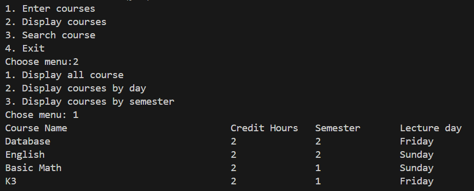

|  | Algorithm and Data Structure |
|--|--|
| NIM |  244107020015|
| Nama |  Aulia Resty Azizah |
| Kelas | TI - 1I |
| Repository | https://github.com/AuliaRestyy/ALSD |

# Labs #1 Programming Fundamentals Review

## 2.1.1. Selection Solution

The solution is implemented in Selection.java, and below is screenshot of the result.

**Brief explanaton:** There are 4 main step: 
1. Input all grades
2. Validate the input
3. Calculate and convert the final grade
4. Decide the final status

## 2.2.1. Looping Solution
The solution is implemented in Looping.java, and below is screenshot of the result

**Brief explanaton:** 
1. Input the nim
2. Modulo the nim, so that theres only 2 last digits left
3. If the nim < 10, add 10
4. Continue numbers 6 and 10
5. Loop the last 2 digits nim, if even print "*" 

## 2.3.1. Array Solution
The solution is implemented in Array.java, and below is screenshot of the result

**Brief explanaton:** 
1. Create array to store course name, credit weight, grade, letter grade, and grade point
2. Input the numerical grade for each course
3. Convert the numerical grade to grade point
4. Map the grade point to a letter grade
5. Calculate the total grade points and total credits
6. Calculate the GPA by dividing the total grades by total credits
7. Display course name, numerical grade, letter grade, and grade point
8. Print the GPA with 2 numbers after the comma

## 2.4.1. Function Solution
The solution is implemented in Function.java, and below is screenshot of the result

**Brief explanaton:** 
1. Display the menu and ask user to choose
2. Display income by looping and multiplying the stock and prices of the same flower type
3. Display stock in Royal Garden 4 by subtracting stocks in Royal Garden 4 with reduction array

## 3.1. Assigenment 1 Solution
The solution is implemented in PlateCode.java, and below is screenshot of the result

**Brief explanaton:** 
1. Input the plate code
2. Looping through array to find the city and print the ciyt name

## 3.2. Assigenment 2 Solution
The solution is implemented in CubeCalc.java, and below is screenshot of the result

**Brief explanaton:** 
1. Display the menu and ask the user to choose
2. Ask for a number
3. If the user chooses "Volume" the program will multiply the number three times
4. If the user chooses "Surface Area" the program will calculate (num*num) * 6
5. If the user chooses "Perimeter" the program will calculate 12 * num

## 3.3. Assigenment 3 Solution
The solution is implemented in CourseSchedule.java, and below is screenshot of the result

**Brief explanaton:** 
1. Display the menu and ask the user to choose an option
2. The courses will be saved in array
3. The program wil display all courses entered, with the option to display all courses, display courses by day, and display all courses by semester
4. Search for a course by matching the input course with the courseName array