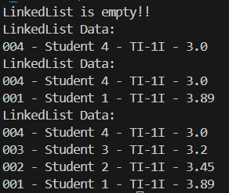
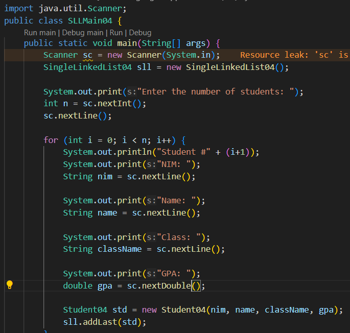
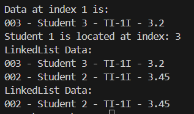
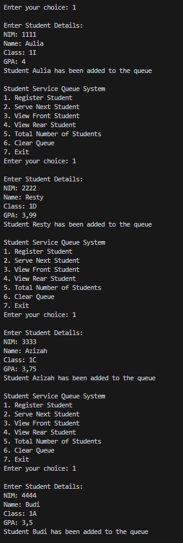
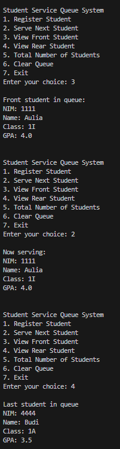
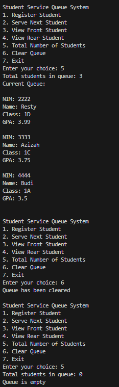

|  | Algorithm and Data Structure |
|--|--|
| NIM |  244107020015|
| Nama |  Aulia Resty Azizah |
| Kelas | TI - 1I |
| Repository | https://github.com/AuliaRestyy/ALSD |

# Labs #12 LINKED LIST

## 2.1.1 Result

**2.1.2 Question** 
1. Because when the method print() is first called in the main method, no data has been added to the list yet. The linked list is still empty head == null, so that the isEmpty() method returns true and prints "LinkedList is empty."
2. The variable temp acts as a traversal pointer used to navigate through the nodes of the linked list, typically starting from head. In print() method temp is used to iterate through and print each node's data. In insertAfter() method temp is used to search the list for the node with a matching name (key) and insert a new node after it. In insertAt() method temp moves through the list to reach the position just before the specified index, where the new node is inserted.
3. Here's the modified version

4. Without tail, the program still works but for specific methods that must access the last index like addLast() it will take more processes. Without tail we have to traverse from head to the last node each time we want to add the end.

## 2.2.2 Result

**2.2.3 Question** 
1. The break keywoard is used to exit the while loop immediately after the target node (the one matching the key) is found and removed.
2. This code is used to remove a node from the middle or end of the list and update the tail id necessary. temp.next = temp.next.next is used to skip the node to be removed by linking the current node (temp) directly to the node after the one being removed. And if (temp.next == null) { tail = temp; } checks whether the removed node was the last node (tail). If so, the current node (temp) becomes the new tail.

## 3. Assignment

**2.2.3 Program Flow** 
1. The program displays a menu of options to the user in while loop inside the main method. The program ask the user to input a number to choose a menu option. Based on the input, a switch-case structure runs the corresponding block of code
2. If the user choose option 1 (Register) the program prompts the user to input student data, and student object is created using the provided input. This object is passed to the enqueue() method
- enqueue() checks id the queue is full using isFull()
- If queue empty, sets both front and rear to the new node
- If not empty, links the new node at the end and moves rear to the new node
- Increment size by 1
3. If the user choose option 2 (Serve Student) the program calls the dequeue() method to remove and return the front student
- dequeue() checks if the queue is empty using isEmpty()
- If not empty, retrieves the student at the front and moves the front to the next data
- If after moving the front becomes null, then set the rear to null
- Decrement size
4. Option 3 (View Front), the program calls peekFront() to check the student at the front of the queue without removing it. peekFront() returns the data of the front node if the queue is not empty
5. Option 4 (View Rear), the program calls peekRear() to check the student at the rear of the queue without removing it. peekRear() returns the data of the rear node if the queue is not empty
6. Option 5 (Total number of student), the program prints the current size of the queue and calls displayQueue() to show all students in the queue from front to rear.
- displayQueue() loop front front using .next until null
- For each node, it calls display() to print the student's data
7. Option 6 (Clear), the program calls the clear() method to set front and rear to null and size to 0.
8. Option 7 (Exit), the program calls System.exit(0) to exit
