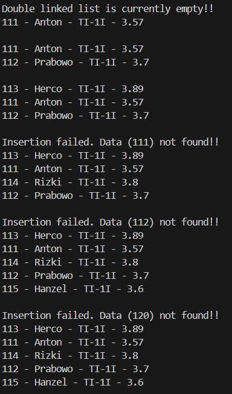
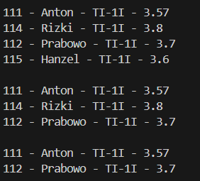
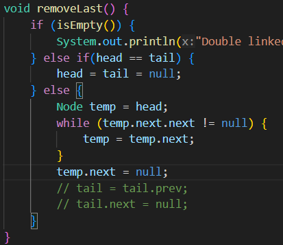
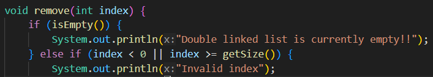
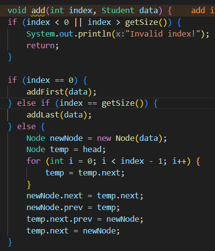
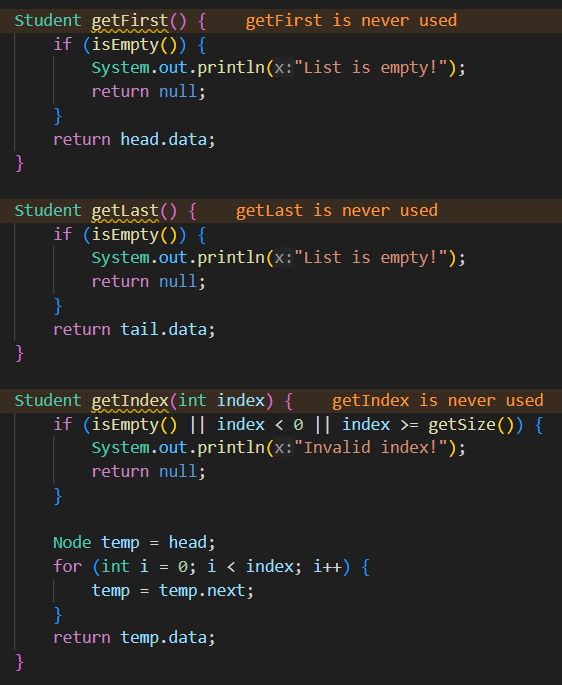
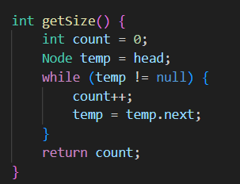
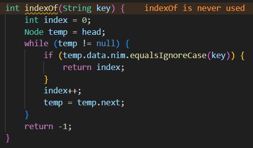

|  | Algorithm and Data Structure |
|--|--|
| NIM |  244107020015|
| Nama |  Aulia Resty Azizah |
| Kelas | TI - 1I |
| Repository | https://github.com/AuliaRestyy/ALSD |

# Labs #13 Double LINKED LIST

## 12.2.2 Result

**12.2.3 Question** 
1. A singly linked list consists of nodes where each node has a next pointer that links to the following node, allowing traversal in only one direction. Meanwhile, doubly linked list contains nodes with both next and prev pointers, enabling bidirectional traversal.
2. next: points to the subsequent node in the list, enabling forward traversal
prev: points to the preceding node, allowing backward traversal.
3. The purpose of the constructor is to initializes an empty list by setting both head and tail to null. This indicate that the list contains no nodes when first created.
4. The code checks if the list is empty. If true, the new node becomes both the head and tail of the list, as it is the only node present.
5. When inserting a new node at the beginning of a non-empty list, head.prev = newNode sets the previous pointer of the current head node to point back to newNode. This establishes a bidirectional link between the new node (now the head) and the former first node.
6. The statement updates the prev pointer of the node that follows current to point to newNode. It ensures the new node is properly linked into the list by placing newNode between current and current.next and maintaining the backward link from current.next back to newNode
7. The print() method implements traversal by iterating through each node starting from head. temp = temp.next advances the temp reference to the next node in the list, allowing the loop to visit every node sequentially until temp becomes null.
8. If the node matching the key (temp) is the tail, this code efficiently appends the new node using addLast(), avoiding manual linkage. If removed, the method would still work but would require explicit handling of tail updates, making the code more error-prone.
9. This code checks whether the nim of the current node matches the search key, ignoring case differences.

## 12.3.2 Result

**12.3.3 Question** 
1. head = head.next moves the head pointer to the next node, effectively removing the first node from the list. head.prev = null ensures the new head node no longer references the removed node (breaks the backward link).
2. This condition checks if the list has only one node, if true both head and tail must be set to null to properly empty the list. Without this check, the methods might incorrectly assume multiple nodes exist, leading to NullPointerException.
3. We can do traverse from head to find the second to last node, then update its next pointer to null like this:

4. This code handle edge cases where the list is empty, avoiding NullPointerException when attempting to access nodes.
5. At the beginning it calls removeFirst() to update head and break the forward/backward links. At the ened it calls removeLast() to update tail and break the links.
6. The process is first locate the node at index(temp) and update the surrounding nodes links temp.prev.next = temp.next; temp.next.prev = temp.prev;
7. Modified code:

## Assignment

1. add()

- The method checks if the index is valid
- If index is 0, it calls addFirst()
- If index equals list size, it calls addLast()
- If index is in middle positions, it locates the node before the target position and insert the new node by adjusting pointers
2. removeAfter()

- The method searches for the node containing the key
- If next node is tail, it calls removeLast()
- For middle nodes, it adjust the pointers
3. getFirst(), getLast(), getIndex()

- getFirst() returns head's data
- getLast() returns tail's data
- getIndex() validates index, traverses to the specified position and returns the node's data
4. getSize()

- The method traverses from head to tail
- Increment counter for each node
- Return total count
5. indexOf()

- The method traverses list while checking each node's nim
- It returns current index if found and -1 if not found

