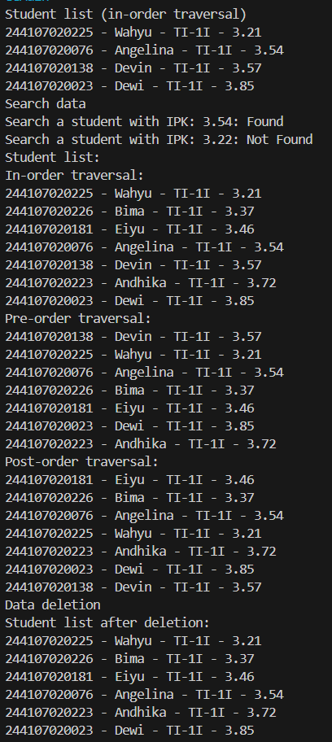
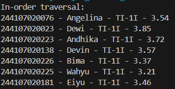

|  | Algorithm and Data Structure |
|--|--|
| NIM |  244107020015|
| Nama |  Aulia Resty Azizah |
| Kelas | TI - 1I |
| Repository | https://github.com/AuliaRestyy/ALSD |

# Labs #14 TREE

## 14.2.1 Result

**14.2.2 Question** 
1. Data searching in a Binary Search Tree (BST) is more efficient than in a regular binary tree because it leverages a sorted structure where all nodes in the left subtree contain smaller values and all nodes in the right subtree contain larger values than the parent node. This allows the algorithm to eliminate half of the tree from consideration at each step, reducing the time complexity.
2. The left and right attributes in the Node class are essential for linking the current node to its left and right children in the binary tree structure. These pointers form the backbone of the tree's hierarchical relationships, allowing recursive and iterative traversal algorithms to navigate through the tree by following the branches from the root to the leaves.
3. a. The root attribute in the BinaryTree class serves as the entry point of the entire tree structure; it holds a reference to the topmost node, from which all other nodes can be accessed.
b. When a BinaryTree object is first created, the root is initialized to null, indicating that the tree is empty and contains no nodes yet.
4. When the tree is empty and a new node is added, the new node becomes the root of the tree. This is checked by the isEmpty() method, and if it returns true, the add() method assigns the new node to the root attribute, effectively initializing the binary search tree with the first element.
5. This block of code determines the correct position to insert a new node in the binary search tree by comparing the new student's GPA with that of the current node. If the new GPA is smaller, it moves left; if greater, it moves right. If the target direction is null, it inserts the new node at that position and exits the loop with break, ensuring the binary search tree property is maintained.
6. When deleting a node with two children, the delete() method replaces it with its in-order successor, which is the smallest node in its right subtree. The getSuccessor() method finds this successor by traversing leftward from the right child of the node to be deleted. Once found, the successor takes the place of the deleted node and preserves the binary search tree properties by ensuring correct reattachment of the successor's right child.

## 14.3.1 Result

**14.3.2 Question** 
1. The data attribute in the BinaryTreeArray class stores the nodes (students) of the binary tree in a fixed-size array, while idxLast keeps track of the last index filled in the array, helping to control tree traversal and avoid accessing uninitialized elements.
2. The populateData() method initializes the array-based binary tree with predefined data and sets the last index, effectively preparing the tree structure in memory for traversal and further operations by assigning the student nodes to the correct positions.
3. The traverseInOrder() method is used to simulate an in-order traversal of the binary tree stored in an array, where it recursively visits the left child, the current node, and then the right child, which is a standard method to print nodes of a BST in sorted order.
4. If a node is stored at index 2 in the array, its left child will be at index 2 × 2 + 1 = 5, and its right child will be at index 2 × 2 + 2 = 6, based on the formula used to represent a binary tree structure in an array.
5. The statement int idxLast = 6 signifies that the last index of the array that contains a valid student object is index 6, which helps the traverseInOrder() function know the bounds of the tree and avoid traversing beyond the available data.
6. The expressions 2 * idxStart + 1 and 2 * idxStart + 2 are used to compute the indices of the left and right children of a node located at idxStart in the array, following the convention of complete binary tree representation where each parent node's children can be calculated using these formulas.

## 14.4 Assignment

