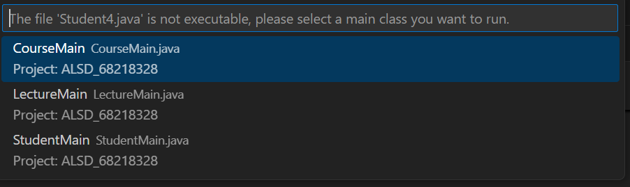
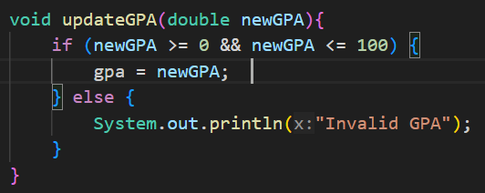
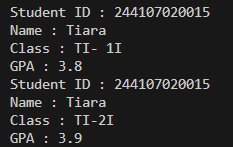
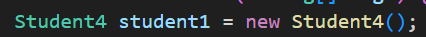
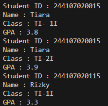
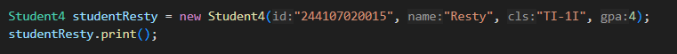
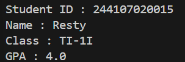
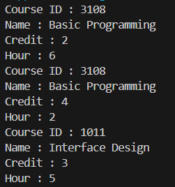
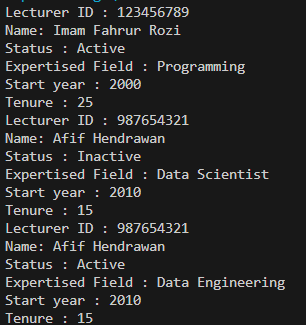

|  | Algorithm and Data Structure |
|--|--|
| NIM |  244107020015|
| Nama |  Aulia Resty Azizah |
| Kelas | TI - 1I |
| Repository | https://github.com/AuliaRestyy/ALSD |

# Labs #1 Programming Fundamentals Review

## 2.1.2. Verification Experiment Result

The program is not executable because it does not have a main method

**2.1.3 Question** 
1. Class can only declare once, while object you can declare it multiple time
2. Student class has 4 attributes such as studentID, name, className, gpa
3. Student class has 5 methods such as print(), print(String id, String name, String cls, double gpa), changeClass(), updateGpa(), evaluate()
4. Modify upateGpa()

5. The evaluate() method evaluates student performance based on their GPA and returns a performance rating as a String using if else

## 2.2.2. Verification Experiment Result

**2.2.3 Question** 
1. The line of code used for instantiation

2. Attribtes and methods of an object are eccessed using the dot notation (.)
3. The output of the first and second print() is different because the state of student1 changes between the two print method

## 2.3.2. Verification Experiment Result

**2.3.3 Question** 
1. The line of code in Student used to declare the parameterized constructor

2. This line used to instantiates new object of the Student class named student2 using parameterized constructor
3. If we remove the default constructor, the error messsage will appear because we declare student1 with default constructor
4. The methods in Student class do not need to be accessed in a specific order after instantiating an object. You can call print() before or after calling updateGPA()
5. I created new object named studentResty

this is the result

## 2.4 Assignments

**Course**

Screenshoot of the result 

The course4 class define the attributes and method of a course object.
The course4 class has 2 constructors, default constructor and parameterized constructor

Attributes
- courseID = a string representing the course ID
- name = a string representing course name
- credit = an integer representing the credit hours for the course
- hour = an integer representing the total hours for the course

Methods
- print() = prints the details of the course
- changeCredit() = updates the credit attribute
- addHour() = increases the hour attribute
- reduceHour() = decreases the hour attribute

course1 created using the default constructor and call print(), changeCredit(), addHour(), and reduceHour() methods

course2 created using parameterized constructor and call changeCredit(), addHour(), and print() method

**Lecturer**

Screenshoot of the result

The Lecturer4 class define the attributes and method of a course object.
The Lecturer4 class has 2 constructors, default constructor and parameterized constructor

Attributes
- lecturerID = a string representing the lecturer ID
- name = a string representing course name
- status = a boolen representing the lecturer's status
- startYear = an int representing the first year they become lecturer
- expertiseField = a string representing the lecturer expertised field

Methods
- print() = prints the details of the lecturer
- setStatus() = set or change the lecturer status
- calculateTenure() = calculate the lecturer tenure
- changeExpertiseField() = change the lecturer expertise field

lecturer2 created using the default constructor and call print(), setStatus(), calculateTenure(), and changeExpertiseField() methods

lecturer1 created using parameterized constructor and call calculateTenure() and print() method