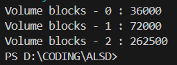
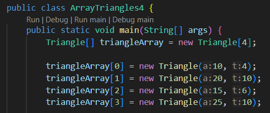
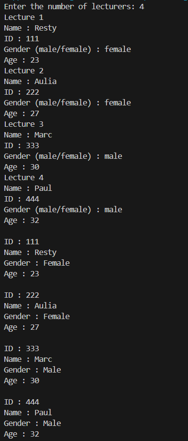

|  | Algorithm and Data Structure |
|--|--|
| NIM |  244107020015|
| Nama |  Aulia Resty Azizah |
| Kelas | TI - 1I |
| Repository | https://github.com/AuliaRestyy/ALSD |

# Labs #1 Programming Fundamentals Review

## 1.2.2 Result

**1.2.3 Question** 
1. A class that is going to be used as an array of objects does not necessarily need to have both attributes and methods. however, since in this case the purpose of creating an array is to store multiple objects, it will make sense for the class to have attributes
2. The Rectangle class does not have parameterized cnstructor, but it does have default constructor
3. This line creates an array that can hold 3 objects of type Rectangle
4. This line creates a new Rectangle object and assigns it to the index 1 in the rectangleArray and set the length of rectangle to 80, and the width to 40
5. Seprating ArrayOfObjects class and Rectangle class is useful for easier maintenance, easier code organization, and so that the class can be called back in another class if needed

# 1.3.2 Result

**1.3.3 Question** 
1. Yes, an array of object can be implemented on a 2D array. 
2. For example, a 2D array of car class where the row is for representing different car and the column represent different brand of the car
3. The error occurs because the Square objects in the array are not instiated before access the side attribute. the line 'squareArray[5] = new Square();' should be added
4. I change the code so it looks like this

The program ask the user to input a number (numInput) and the rectangleArray is created with numInput length. I change the for loop so that it loops according to the legth of numInput

5. If we instantiate twice, the second instantiation will overwrite the first one, and the first object will be lost

# 1.4.2 Result

**1.4.3 Question** 
1. Yes, we can have more than one constructor in one class, each constructor must have a unique parameter list. This allows us to create objects in different ways
2. Result

3. Add methods

- countArea, like the triangle formula in general, this method returns 0.5 times base times height
- countPerimeter, i assume the triangle is a right triangle, so first this method will find the hypotenuse, and then add the base, height, and hypotenuse

4. Instantiate array of Triangle object

5. Call the method

# 1.5 Assignment

1. Result of LectureDemo4

2. Result after i add some methods

- In the showAllLecturerData method i use a for each loop and call the print method which i previosuly created in Lecturer4
- In the countLecturerByGender method i create a new variable to track the male and female lecturer and used a for each loop to check if lecturer.gender equals with "male", if it is equal then the male variable will increase, if it is not equal then the female variable will increase
- In averageLecturerAgeByGender is more or less same as countLecturerByGender, but i add 2 new variables to add all the lecturer.age by gender (maleAgeSum & femaleAgeSum), in every for each loop that checks gender, the loop will also add their age by gender. When the loop ends, the variables maleAverage will store the value of maleAgeSum divided by maleCount, and the variable femaleAverage will store the value of femaleAgeSum divided by femaleCount
- In showOldestLecturerInfo method, i initially set the variable oldest to lecturer in index 0, then use for each loop to check whether the lecturer in next index is older, if so then variable oldest will be set to the lecturer with that index
- In showYoungestLecturerInfo method i initially set the variable youngest to lecturer in index 0, then use for each loop to check whether the lecturer in next index is younger, if so then variable youngest will be set to the lecturer with that index