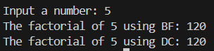
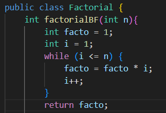
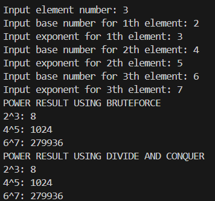
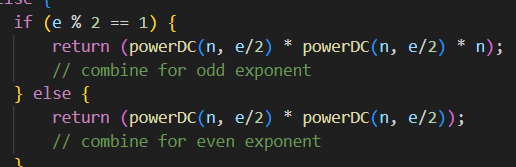
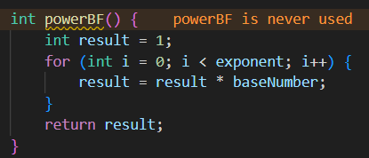
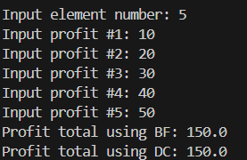

|  | Algorithm and Data Structure |
|--|--|
| NIM |  244107020015|
| Nama |  Aulia Resty Azizah |
| Kelas | TI - 1I |
| Repository | https://github.com/AuliaRestyy/ALSD |

# Labs #1 Programming Fundamentals Review

## 5.2.2 Result

**1.2.3 Question** 
1. The if condition is the base case and the else condition is the recursive case. When the problem reaches the base case (n == 1), it is solved directly without proceeding to the recursive case.
2. Yes, the for loop method can be replaced with a while loop or do-while loop. Here is an example using a while loop

3. facto = facto * i is a brute force approach, facto is updated in each iteration of the loop by multiplying it with i. Meanwhile int facto = n * factorialDC(n-1) is a divide and conquer approach, this is a part of recursive approach, it calculates the factorial by breaking the problem into smaller subproblems (factorialDC(n-1))
4. The differences between factorialBF() and factorialDC() is factorialBF() uses an iterative approach with a loop, does not rely on the call stack and its easier to understand and implement for small problem. Meanwhile factorialDC() uses a recursive approach it breaks the problem into smaller subproblems and combines the result, relies on the call stack

## 5.2.2 Result

**1.2.3 Question** 
1. The powerBF() uses an iterative approach with a for loop. Calculates the power by multiplying the base number(n) by itself e times. It simple and straightforward but less efficient for large exponents. The powerDC() uses a recursive approach. Breaks the problem into smaller subproblems by dividing the exponent (e) by 2 and combines the result using the formula, more efficient for large exponents but slightly more complex due to recursion
2. Yes, the combine stagae exists in the powerDC() method. It combines the result of the smaller subproblems to solve the original problem. The code is 

3. The parameters are used to pass the base number and exponent explicitly, this makes the method reusable independent of the class attributes. Here is the powerBF() method without parameters

4. powerBF() 
- uses a loop to multiply the base number (n) by itself e times
powerDC()
- uses recursion to break the problem into smaller subproblems
- combines the result, (powerDC(n, e/2) * powerDC(n, e/2)) for even exponent
- combines the result (powerDC(n, e/2) * powerDC(n, e/2) * n) for odd exponent

## 5.2.2 Result

**1.2.3 Question** 
1. The mid variable is used to divide the array into 2 section in the totalDC() method. This is a key step in divide and conquer approach, where the problem is split into smaller subproblems
2. totalDC(arr, 1, mid) is used to recursively calculate the sum of the left part of an array from index l to mid. totalDC(arr, mid+1, r) is used to recursively calculates the sum of the right part of the array, from index mid+1 to r
3. This code is important because after dividing the problem into smaller subproblems we need to combine their solutions to solve the original problem
4. The base case of totalDC() is when the left index equals the right index, it means there is only one element in the current subarray, the base case simply returns that single element as the sum
5. totalDC() method 
- Base Case: when the subarray has only one element (l == r), the base case returns that element as the sum
- Divide: array is divided into 2 parts using the midpoint (mid = (l+r) / 2)
- Conquer: the sum of each half is calculated independently using recursive calls (lsum and rsum)
- Combine: the result of the left and right parts are combined by adding them together (return lsum + rsum)

