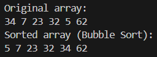
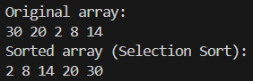
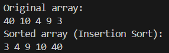
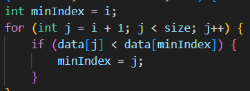
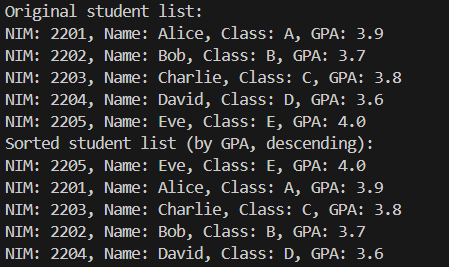
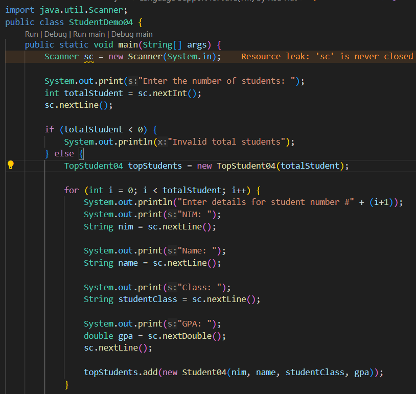
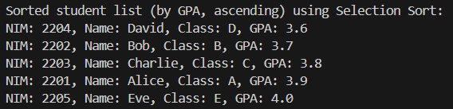
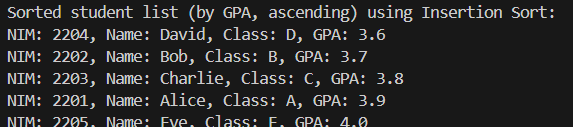
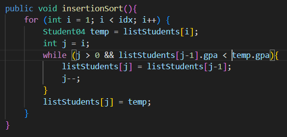
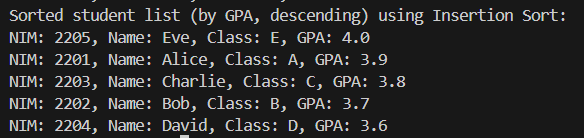

|  | Algorithm and Data Structure |
|--|--|
| NIM |  244107020015|
| Nama |  Aulia Resty Azizah |
| Kelas | TI - 1I |
| Repository | https://github.com/AuliaRestyy/ALSD |

# Labs #5 Sorting (Bubble, Selection, Insertion Sort)

## 6.2.2 Result Bubble Sort

## 6.2.3 Result Selection Sort

## 6.2.4 Result Insertion Sort

**6.2.5 Question** 
1. This code is a part of bubble sort algorithm, used to compare 2 adjacent elements (data[j] and data[j+1]), if current element (data[j]) is greater than the next element (data[j+1]), the 2 elements are swapped. The swapping process uses a temporary variable (temp), the value of data[j] stored in temp, meanwhile the value of data[j+1] moved to data[j]. This code used to ensure that smaller elements to the left and larger elements to the right
2. The minimum value search algorithm is implemented in this code 

variable minIndex is used to track the index of the smallest element in the unsorted array

3. This condition is used to find the correct position for the key in the sorted array. j >= 0 ensures that the loop does not go out of bounds and data[j] > key is used to checks if the current element (data[j]) is greater than the key
4. This command shifts the element at index j one position to the right, it used to make space for the key to be inserted into its correct position in the sorted array. After shifting all elements greater than the key to the right, the key is placed in the correct position using data[j+1] = key

## 6.3.3 Result Sorted Student List using Bubble Sort

**6.3.4 Question** 
1. From the nested loop

a. The condition i < idx - 1 ensures that the outer loop runs for idx - 1 iterations

b. The condition j < idx - i - 1 ensures that the inner loop does not compare elements that are already in their correct positions

c. The i loop will execute 49 times so bubble sort will perform 49 stages

2. Update StudentDemo04 Class

## 6.3.8 Result Sorted Student List using Selection Sort

**6.3.9 Question** 
1. This code is responsible for finding the index of the student with the smallest GPA in the unsorted part of listStudents array. 
- First this code will initializes the variable minIndex to the current value of i, i represent the starting index of the unsorted part of array
- And then loop iterates through the unsorted part of the array to compare each element in the unsorted part with the current minIndex.
- After that check if GPA of the student at index j is less than the GPA of the student at index minIndex, if true it means a smaller GPA has been found and the mixIndex is updated to j

## 6.3.12 Result Sorted Student List using Insertion Sort

**6.3.13 Question** 
1. Update insertionSort() method

Result

**6.4 Assignment** 
- The Lecturer class represents a lecturer with id, name, gender, and age
- LecturerData class manages an array of Lecturer objects and provides methods to add, print, and sort the lecturers
- add() method is used to add a Lecturer object to the lecturerData array if there is space
- print() method is used to iterates through the lecturerData array and calls the print() method for each Lecturer object to display their details
- sortingAsc() is used to sorts the lecturerData array by age in ascending order using the bubble sort algorithm
- sortingDsc() is used to sorts the lecturerData array by age in descending order using the insertion sort algorithm
- LecturerDemo class contains the main mathod, which is the entry point of the program
- LecturerDemo class creates a LecturerData object with this code LecturerData lecturersData = new LecturerData();
- Ten Lecturer objects are created and added to the lecturersData array using add() method
- The original list of the lecturers is printed using the print() method
- Then sortingAsc() method is called to sort the lecturers by age in ascending order, and then the sorted list is printed
- sortingDsc() method is called to sort the lecturers by age in descending order, and then the sorted list is printed