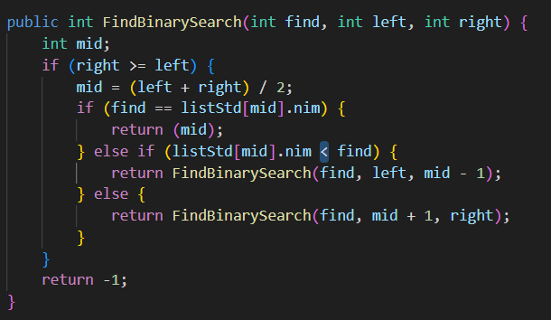

|  | Algorithm and Data Structure |
|--|--|
| NIM |  244107020015|
| Nama |  Aulia Resty Azizah |
| Kelas | TI - 1I |
| Repository | https://github.com/AuliaRestyy/ALSD |

# Labs #5 Searching

## 7.2 Result

**7.3 Question** 
1. The displayPosition() method is used to only displays the index where the searched student is found and showData() method displays he details of the found student
2. The break is used to stops the loop immediately when the student is found
3. In findSeqSearch() method that use sequential search no error will occur because sequential search is fine without sorting
4. The variable position initialized to -1 to indicate "not found" because if we initialize to 0, the program mistakenly return index 0 even if the student is not in the list

## 7.3.2 Result

**7.3.3 Question** 
1. The program code that runs the divide process is int mid = (left + right) / 2, it splits the array into 2 parts
2. The program code that runs the conquer process

3. For binary search (findBinarySearch) the result will be incorrect if the data is not sorted. If the array is sorted from largest to smallest, the binary search method will not work correctly because it assumes the data is in ascending order. To make it work we should change the symbol from > to < or make 2 condition using if-else to check whether the data is sorted in ascending or descending order

4. MainStudent class after modification

The program will ask user how many students to enter and set it as the length of listStd array

## 7.4.3 Result

SortMain class

SortMain output

**7.5 Assignment** 
1. On jobsheet 5
- add findNameSeqSearch() method using sequential search

- add findAgeBinarySearch() method using binary search

I combine show index and show data from the student being searched into one method and call it in the main method

